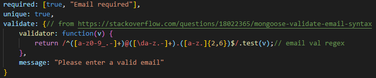

# Challenge 18 - Mongoose/MongoDB

## Video Demo

- [Most of the routes; missing one or two only](https://www.youtube.com/watch?v=ZqlzxQ1hP5E) 
- [Reaction and Friends routes](https://www.youtube.com/watch?v=qcrlk6QB4aY)

### Task Summary

Create a Mongoose based back end for a simple forum infrastructure.

This week we had to make a Mongoose based database which forms the backbone of what appears to be a very simple forum. There are routes for account creation, as well as thread and comment creation. It even has a friends list system. But not only are there post routes to create these things, we also include the ability to delete and edit the things.

All fields are required, with the username and related info being unique, and the text bodies have a character limit. 

 
The various validators in use; the algorithm I got via research online, but because I chose an Email Validation Regex as my topic for [last week's assigntment](https://gist.github.com/liaof/df0e119588ad9adc0e2471665a98ef81).

### Usage

Download into a git and npm initalized directory and run 'npm install' to install dependencies. Then type 'npm start' and go to http://localhost:3001/api(followed by either /users or /thoughts) in either your browser or Insomnia. 
For the endpoints, [thought's can be found here](./routes/api/thought-routes.js) and [user's here](./routes/api/user-routes.js)

##### Tools used

- Mongoose.js 
- MongoDB

##### Resources used

- [the validator used for the email is from here](https://stackoverflow.com/questions/18022365/mongoose-validate-email-syntax) 
- [Mongoose documentation](https://mongoosejs.com/docs)
